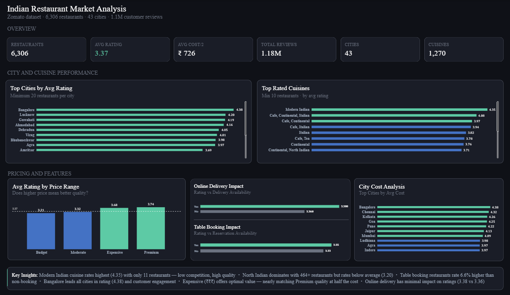

# Zomato Restaurant Data Analysis & Data Warehousing

## Overview

An end-to-end restaurant analytics project using **MySQL, SQL, Data Warehousing, and Power BI** to analyze Zomato restaurant data and generate business insights.

The project covers data cleaning and ETL, Star Schema implementation, SQL analysis, and Power BI visualization.

## Project Workflow

**Zomato Dataset → ETL & Data Cleaning → MySQL Star Schema → SQL Analysis → Power BI Dashboard**

## Tech Stack

- MySQL 8.0
- SQL
- Power BI
- Excel / CSV

## Data Warehouse

Implemented a **Star Schema** in MySQL consisting of:

- `FACT_Restaurants`
- `DIM_City`
- `DIM_Cuisine`
- `DIM_PriceRange`
- `DIM_Features`

The fact table contains key measures such as **ratings, average cost, and votes**, while the dimension tables support analysis by city, cuisine, price range, and restaurant features.

## Analysis

The project analyzes:

- Restaurant distribution across cities
- Ratings and customer engagement
- Price-range performance
- Online delivery and table booking
- Cuisine performance
- City-level restaurant performance

## Power BI Dashboard



The dashboard presents the key findings through interactive visualizations and KPIs.

## Key Insights

- Restaurant ratings and pricing showed noticeable variation across price ranges.
- Restaurants with table booking generally had higher ratings and average costs.
- Restaurant count did not necessarily correspond to higher cuisine ratings.
- City-level analysis revealed differences in pricing, ratings, and customer engagement.

## Project Structure

```text
zomato_analysis/
├── power_bi_dashboard/
├── raw_data/
├── screenshot/
├── sql_database/
├── sql_exports/
└── sql_queries/
